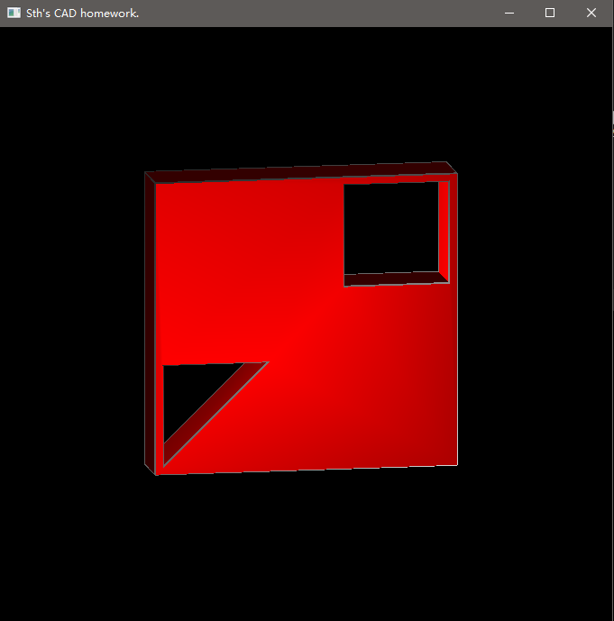
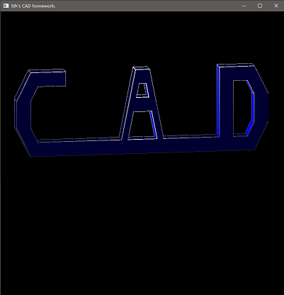

## CAD homework by LiuZengqianq  

### 环境

freeglut + glm + JsonCpp  
visual studio 2019 + CMake

### 实现功能
1. 实现五种基本欧拉操作：mvsf()，mev()，mef()，kemr()，kfmrh().
2. 实现sweep构造实体。
3. 显示实体：增加一个光源，便于观察判断面的法向。
4. **使用w、a、s、d按键控制转动视角，使用4、6、2、8按键控制光源位置(注意需要在英文输入法下)。**

5. **若读者实验环境不同，可以直接运行Brep\release\Brep.exe ，该可执行文件的输入文件为Brep\release\inputFile\data.json**

### 主要代码结构
    - Brep/Brep/src/datastrcut 中包含Solid、Face、Loop、Edge、Halfedge和Vertex数据结构。
    - Brep/Brep/src/scene 中包含mvsf()、mev()、mef()、kemr()、kfmrh()五种欧拉操作的代码。
    - Brep/Brep/src/sweeper 中的包含sweep的算法代码和调用opengl显示三维实体的代码。
### 输入规范

使用.json格式文件作为输入。json文件中需要包含需要被sweep的二维面"Face"的轮廓点"Vertex"位置，该面包含的内环"Ring"的轮廓点，扫成的方向"SweepVector"以及扫成的长度"SweepScale"，显示三维实体时的表面颜色"Color"。

并且需要满足以下条件：

1. 默认二维面Face在X-Y平面上，沿Z轴负方向扫成。

2. 只可以输入一个Face面。

3. Face面和内环的轮廓点按逆时针输入，在(-1.0, 1.0)范围内。

4. Face面可以包括多个内环。

5. "SweepVector"需要保证z值小于0.

6. "SweepScale"建议小一点（默认身为0.1），太大时会超出窗口。

输入示例：
```json
{
  "Face": {
  	// 需要被sweep的面的轮廓坐标，该例子中是一个正方形
    "Vertex": [
      [ 0.5, 0.5 ],
      [ -0.5, 0.5 ],
      [ -0.5, -0.5 ],
      [ 0.5, -0.5 ]
    ],
    // Face面的内环，该示例中有两个内环，两个内环一个正方形一个是三角形
    "Ring": [
      [
      	// 第一个内环，矩形内环
        [ 0.475, 0.475 ],
        [ 0.125, 0.475 ],
        [ 0.125, 0.125 ],
        [ 0.475, 0.125 ]
      ],
      [
      	// 第二个内环，三角形内环
        [ -0.125, -0.125 ],
        [ -0.475, -0.125 ],
        [ -0.475, -0.475 ]
      ]
    ]
  },
  // 扫成方向
  "SweepVector": [
    0,
    0,
    -1
  ],
  // 扫成长度
  "SweepScale": 0.2,
  // 显示时面的颜色
  "Color": [
    1.0,
    0.0,
    0.0
  ]
}
```
### 直接运行
在命令行中直接运行Brep.exe文件+输入文件路径，默认读取同目录下./inputFile/data.json文件作为输入
运行示例：


### 运行预览
示例预览：  

  

其他示例预览：  
